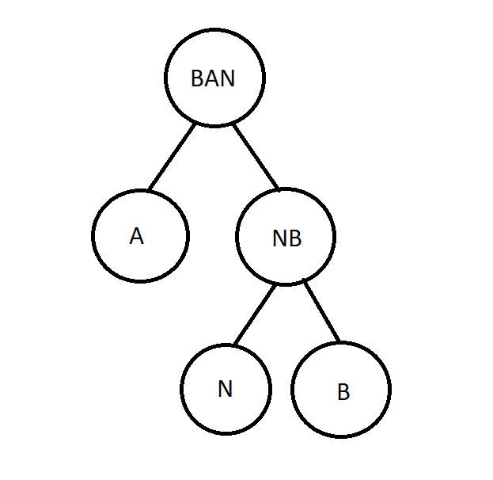

# The-last-Forca

Esse é um trabalho da disciplina Algebra Linear e Teoria da Informação, do curso ciências da computação do Insper. A ideia é criar um modelo de jogador para jogar e ganhar o máximo de vezes possivéis o jogo da forca.

## Como Rodar

- Para rodar o código basta executar o arquivo "forca.ipynb", não é necessário a instalação de nenhuma biblioteca.

## Código de Huffman

O código de huffman tem como objetivo comprimir o máximo possivel os bits de um código, isso com o intuito de agilizar seu tempo de processamento. Para isso, fazemos a análise dos elementos mais frequentes. Vamos então usar como exemplo a palavra $BANANA$. Nesse caso a distribuição de bits inicial acontece da seguinte forma:

* N = 00 = 2 bits
* A = 01 = 2 bits
* B = 1 = 1 bits

Sendo representado como: 10100010001

total = 11 bits

Porém podemos através do código de huffman alterar a distribuição de bits. Primeiro olhamos para distribuição das letras individualmente:

* N = 2 aparições
* A = 3 aparições
* B = 1 aparição

Dessa forma podemos reconstruir a árvore, visando os menores bits para as letras mais frequentes:

* N = 01 = 2 bits
* A = 1 = 1 bits
* B = 00 = 2 bits

Sendo representado como: 001011011

total = 9 bits

## Implementação

Usamos o código de huffman para realizar a inteligência por trás do nosso jogador. Em toda rodada de toda partida verificamos qual é a letra mais frequente em nosso banco de dados para tentar adivinhar(sem repetir letras).
