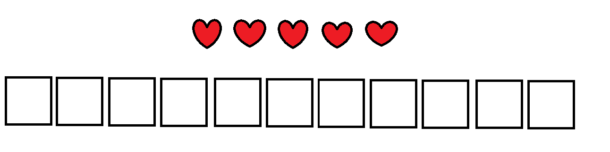
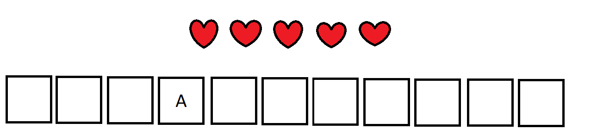
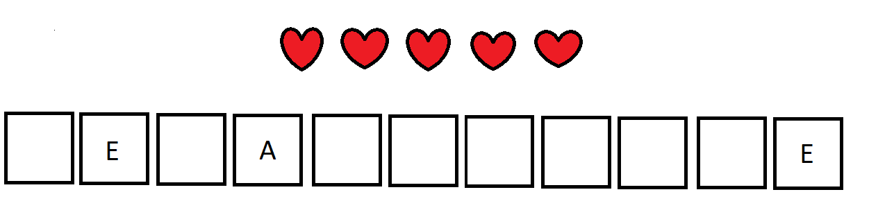
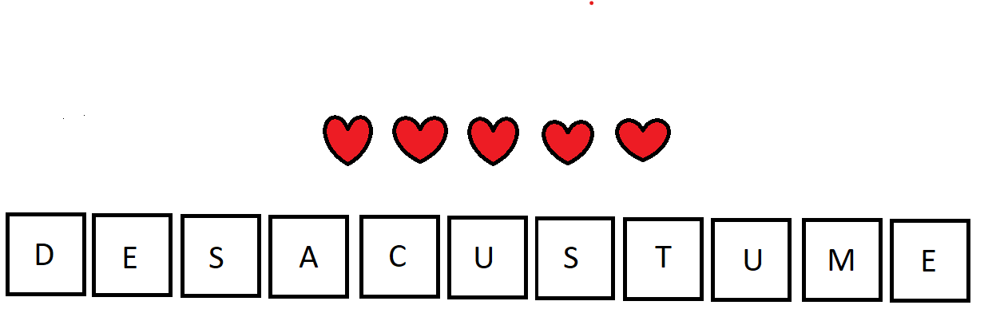

# The-last-Forca

Esse é um trabalho da disciplina Algebra Linear e Teoria da Informação, do curso ciências da computação do Insper. A ideia é criar um modelo de jogador para jogar e ganhar o máximo de vezes possivéis o jogo da forca.

## Como Rodar

- Para rodar o código execute o arquivo "forca.ipynb", não é necessário a instalação de nenhuma biblioteca.

## Implementação

Para ganharmos o máximo de jogos possíveis chegamos a conclusão que o método mais eficiente é sempre buscar a letra mais provavel, uma vez que dessa forma existe uma probabilidade maior dela estar presente na palavra. Para fazer isso, usamos uma base de dados já estabelecida que possui todas as palavras que podem ser sorteadas em nosso jogo.

Usaremos por exemplo a palavra $DESACUSTUME$.

Inicialmente nosso jogador irá receber apenas a quantidade de caracteres que a letra tem:

Apartir disso, filtramos a nossa base de dados para apenas as palavras com a quantidade de letras correspondentes (nesse caso onze).

Agora precisamos chutar uma letra. Para isso, pegamos nossa base de dados já cortada e percorremos palavra por palavra armazenando a quantidade de aparições de cada letra. Dessa forma, verificamos qual foi a letra mais recorrente e chutamos ela. Nesse caso chutamos a letra "A":

Agora precisamos de uma nova letra para chutar. Para isso filtramos nosso banco de dados denovo, para excluir todas as palavras que não possuem a letra "A" nas posições desejadas. 

Após filtrar, precisamos achar uma nova letra para chutar. Ao percorrermos nosso novo banco de dados filtrado, verificamos que a letra mais frequente agora é a letra "E". Ao chutar a letra, recebemos a seguinte resposta:

Repetimos esse processo até a palavra ficar completa com todas as letras:

letras chutadas:
1. S
2. D
3. C

Assim nosso jogador chega a palavra certa!

 Importante notar que nesse exemplo o jogador não erra nenhuma letra, caso errase ele perderia uma vida e filtraria o banco de dados para todas palavras que não tenham a letra chutada.

